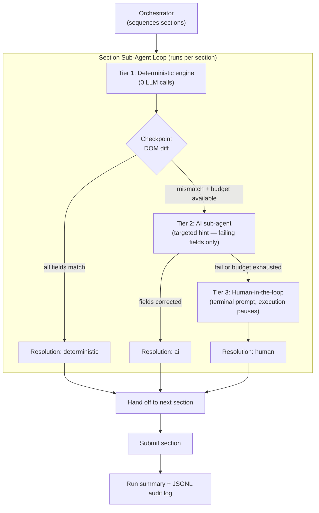
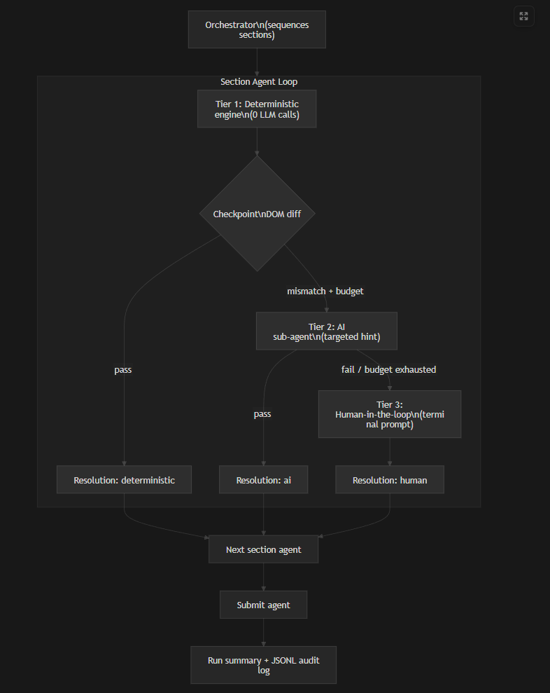

# Form-Based API Wrapper Generator — Architecture & Approach

> **Samaksh · February 2026**

---

> **On AI use:** A fair amount of AI assistance was used during development — for boilerplate, refactoring, and working through implementation details quickly. Every design decision in this document — the deterministic-first architecture, the 3-tier pipeline, the budget cap, the human fallback model — was mine. 

---

## Contents

1. [Why deterministic-first](#why-deterministic-first) — why the AI runs last, not first, and how the quota math drove the architecture
2. [How the Workflow Runs](#how-the-workflow-runs) — the 3-tier pipeline (deterministic → AI → human) and what each tier does
3. [What Changed Along the Way](#what-changed-along-the-way) — the actual evolution: flat script → AI-first → deterministic-first
4. [Limitations and Honest Tradeoffs](#limitations-and-honest-tradeoffs) — what I'd do differently in a production system

---

## Why deterministic-first

Rather than having the AI drive every single action — which would burn through the 20-calls/day free-tier quota in a single run and add unnecessary latency with no accuracy benefit — the system is built so the **deterministic engine does all the real work** and the AI only steps in when something actually goes wrong. On a clean, well-formatted input the whole form gets filled with zero LLM calls. The AI exists purely as a smart recovery layer. When the engine fills a date field and the DOM says it's still empty, *then* we call Gemini with a precise hint about exactly what broke. Not before.

In production this translates directly to lower cost per run and more predictable latency, since the vast majority of runs never touch the LLM at all.

---

## How the Workflow Runs

Here's what happens when you kick off a run:

1. A Playwright browser opens and navigates to the form.

2. The **orchestrator** takes over. It knows there are four sections to complete — Personal Information, Medical Information, Emergency Contact, and Submit — and it processes them in sequence.

3. For each section, a sub-agent runs a **3-tier pipeline**:

   - **Tier 1 — Deterministic engine.** The agent attempts to fill every field using hand-tested selectors and known form structure. No LLM involved. If the input is clean and well-formatted, this is the only tier that runs. The engine retries each step once on failure (with a DOM-settled wait) before moving on.

   - **Tier 2 — Checkpoint + AI recovery.** After the engine finishes, a checkpoint reads the actual DOM values and diffs them against what we expected to see. If everything matches, the section is done. If something is off — say, a date field expected `1992-03-03` but still shows blank — the AI sub-agent is called with a targeted hint listing only the failing fields. It doesn't re-drive the whole form. It gets told exactly what broke and fixes just that. There is a hard budget cap of 4 LLM calls per run — once that's exhausted, the AI tier is skipped entirely.

   - **Tier 3 — Human-in-the-loop.** If the AI also fails, or if the budget is gone, the system prints a field-by-field breakdown to the terminal: what the selector is, what value we expected, what the DOM actually shows, and any format hints. Execution pauses. A human fixes it. Then the pipeline re-checks and continues.

4. After all four sections, the orchestrator collects each section's outcome — `deterministic`, `ai`, `human`, or `skipped` — and generates a **run summary**. If LLM budget is still available, the summary is AI-generated: Gemini receives the full list of outcomes and produces a natural-language description of what happened, which fields needed recovery, and what was done to fix them. If the budget is exhausted, the system falls back to a deterministic summary assembled from the outcome tags — still meaningful, just structured rather than prose.

5. Every event in the run is written as a structured JSON line to a per-run audit log file, giving a complete trace of every decision made. When an AI fallback runs, the model's reasoning text is captured alongside the tool calls — making it easy to see how Gemini interpreted a malformed field and spot prompt gaps without any extra API calls.

The API and scheduling layer sits alongside this: a lightweight HTTP server accepts `POST /run` to trigger a run immediately or `POST /enqueue` to add it to a file-backed queue. A cron job drains that queue on a schedule, processing one item per tick. To make variable injection practical, I also added a set of helper scripts — a PowerShell script (`scripts/trigger-api.ps1`) and a Bash equivalent (`scripts/trigger-api.sh`) that build the JSON body from `key=value` arguments and POST it to the server, as well as a direct CLI entry point (`npm run trigger -- firstName=Samuel lastName=Kalt`) that bypasses the server entirely and runs the workflow in-process. All three accept any combination of fields; anything not specified falls back to the default SOP values, so you can override one field or all of them.

---

## What Changed Along the Way

This wasn't the original design. Here's how it actually evolved:

**Starting point:** A flat Playwright script with no AI at all. Just navigate, fill fields, submit. Once that worked, I refactored it into a proper step engine with an `observe → act → verify` pattern, retry logic on failure, and screenshot capture when something went wrong.

**First AI attempt:** I added LLM agents and wired them into an orchestrator with retries. The agents worked — but I immediately hit the rate-limit wall. `gemini-2.5-flash` on the free tier caps at 5 requests per minute. With each retry being a full LLM call, Section 1 was failing with a quota error before Section 2 even started. That was the blocker that forced the rethink.

**Second attempt — one LLM call per section:** The next idea was to constrain the AI to exactly one call per section and let it handle the full section in that single pass. Cleaner than unbounded retries, but it still meant 3–4 LLM calls on every run regardless of whether anything actually went wrong. During testing this kept exhausting the daily quota. That was the signal that the model itself was wrong — not just the retry count.

**The pivot:** The real question was: why involve the AI at all when the input is well-formatted and the selectors are known? I inverted the model entirely. The deterministic engine runs first and handles the happy path with zero LLM calls. The AI only enters when a post-section checkpoint detects a concrete DOM mismatch — and even then, only for the specific fields that failed. A `RunBudget` cap of 4 LLM calls per run ensures a single execution can never exhaust the daily quota regardless of how many sections fail. When the budget is gone, the system routes to human fallback instead of crashing.

**Later additions:** Once the core pipeline was stable, I added the HTTP API, the file-backed run queue, the cron scheduler, and an 8-scenario test suite split into happy-path runs (expected zero LLM calls) and AI-recovery runs (deliberately malformed inputs to exercise the fallback logic).

---

## Limitations and Honest Tradeoffs

A few things I'd do differently in a production system:

**File-backed queue.** `queue.json` is fine for this scale and eliminates any database dependency. But it has no atomic locking — two concurrent cron processes could race on the same item. A DB-backed queue or message broker would be the right call in production.

**Single model, no provider fallback.** If Gemini is unavailable, the AI tier fails gracefully to human fallback — the run doesn't crash. But there's no secondary provider configured. A production system with SLA requirements would want a fallback model or cached recovery patterns for common failures.

**Single-pass AI recovery.** Each AI agent is constrained to one LLM decision pass. That's a deliberate quota and reliability choice, but it means a complex failure requiring sequenced interactions across multiple fields might not fully recover in one shot. The targeted hint makes single-pass recovery sufficient for the cases this is designed for, but it's a real ceiling.

**Cron is polling, not event-driven.** The scheduler checks the queue every 5 minutes. For a workflow processing time-sensitive tasks, a webhook or event-driven trigger would be more appropriate.

**No dedicated enqueue script.** `trigger-api.ps1` only hits `POST /run` — there's no equivalent helper script for `POST /enqueue`. For now, enqueuing requires calling the endpoint directly via `Invoke-WebRequest`.

**No evals framework.** A production-grade agent platform would run model bake-offs per use case — measuring cost, accuracy, and efficiency across providers to pick the best model for each workflow. This project uses one fixed model with a hand-written test suite.

**Human intervention audit trail is partial.** The log records that intervention happened but not what the operator changed — worth adding an optional comment prompt so the operator can note what they corrected; that note would then surface in the run summary.

**Browser lifecycle after submission.** Single CLI runs (`npm run dev`, `npm run trigger`) leave the browser open after submission so you can inspect the filled form — the process waits for the window to be manually closed. Cron and API-triggered runs close the browser immediately once the success state is confirmed, since those are automated and accumulating idle tabs across scheduled runs would be a problem.

**Rate-limit-aware fallback.** Currently the system skips the AI tier when the `RunBudget` cap is reached — but that cap is based on a counter, not on actual API response errors. If a mid-run rate limit hit occurs (a 429 from Gemini), the system doesn't yet fast-forward the remaining sections straight to human fallback. It would be straightforward to catch that specific error and immediately drain the budget. That said, in practice the `RunBudget(4)` cap keeps total calls well within the per-minute and per-day limits.

---

For the full technical walkthrough — file structure, exact execution flow, API reference, and detailed design tradeoffs — see [README.md](README.md). For an account of how the project evolved, see [Progress.md](Progress.md).
