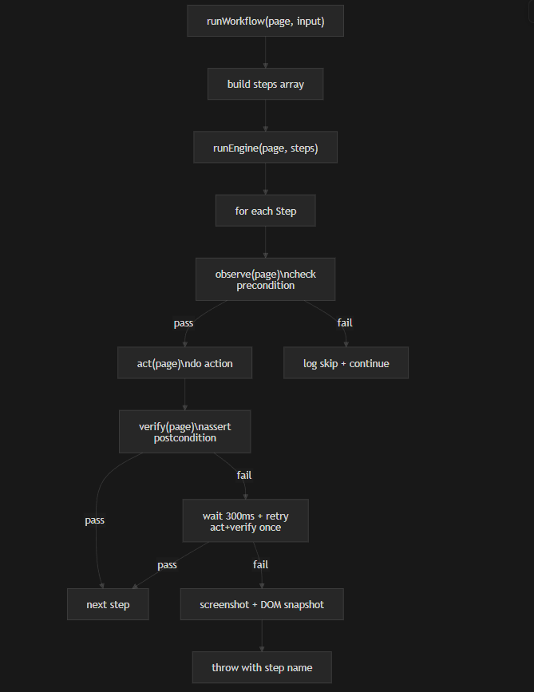

# Progress
---

### `519c5c4` -  Initial commit
Set up the full project scaffold: TypeScript config, Playwright session factory (`session.ts`), Gemini AI SDK wired via `setup.ts`, `.env` for the API key, and `README.md`.

---

### `88af2b9` -  Fix API config
Corrected the Gemini model version to `gemini-2.5-flash`, added `.env` to `.gitignore`.

---

### `29e604b` - Form inspection
Added `inspect.ts` — a Playwright script that maps every field, dropdown, and accordion section on the live form. Output documented in `FORM_NOTES.md` (selectors, dropdown values, success-state strategy).

---

### `73dbc65` - Core workflow
Added `workflow.ts` with a typed `WorkflowInput`, fills all four Section 1 fields with post-fill DOM assertions, submits, and confirms success. Wired into `main.ts` with hardcoded SOP values.

---

### `ae051be`  - Agentic loop engine
Refactored the flat workflow into a proper automation engine. Added `engine.ts` with a typed `Step` interface (`observe > act > verify`) and a `runEngine` loop with retry and screenshot-on-failure. Refactored `workflow.ts` into 7 discrete `Step` objects using a `fillWithFallback` helper that tries multiple selectors in order. `runWorkflow` replaces `runForm` in `main.ts`.

**Flow:** `runWorkflow` builds a steps array via `buildSteps(input)`, then delegates to `runEngine(page, steps)` which iterates each step — running `observe` to check the precondition, `act` to interact, and `verify` to assert the result. On verify failure it waits 300ms and retries once; on second failure it captures a screenshot + DOM snapshot to `debug/` and re-throws.

---

### `9b32db0` - Sections 2 & 3 + optional fields
Extended `WorkflowInput` with optional fields for Sections 2 and 3 (`gender`, `bloodType`, `allergies`, `medications`, `emergencyContact`, `emergencyPhone`). Added `makeOpenSectionStep` to click and expand accordion sections, and `makeSelectStep` for dropdowns (selects by visible label text). Steps for both sections are skipped automatically if their fields aren't provided. Updated `main.ts` with full SOP values across all three sections.

---

### `c482815` - LLM agents + orchestrator + logging
Replaced the deterministic engine with a full agentic loop. Added `src/agents/` with four LLM-driven agents (`section1Agent`, `section2Agent`, `section3Agent`, `submitAgent`), each using Gemini tool calls to interact with the form via Playwright browser tools defined in `src/tools/browserTools.ts`. An `orchestrator` runs each agent in sequence with up to 3 retries per section and a **human-in-the-loop fallback** if all retries fail. Added `src/logger.ts` for structured JSONL audit logs written per run to `logs/`. `main.ts` now accepts `Partial<WorkflowInput>` overrides, enabling variable injection.

> **Blocker:** Hitting Gemini free-tier rate limits (5 req/min on `gemini-2.5-flash`). Section 1 fails after exhausting retries with a quota error. Need a paid API key or a delay/backoff strategy between tool calls.

---

### `799135e` - 3-tier fallback pipeline + section checkpoints
Overhauled the orchestrator into a 3-tier pipeline per section: **Tier 1** runs the deterministic engine (zero LLM calls on success); **Tier 2** reads the actual DOM via a post-section checkpoint (`checkSection1/2/3`), diffs it against expected values, and invokes the AI sub-agent with a targeted hint listing only the failing fields; **Tier 3** falls back to human-in-the-loop if the AI also fails. Added a `RunBudget` class (max 4 LLM calls per run) that skips AI recovery and jumps straight to human fallback when exhausted — directly addressing the rate-limit issue. Split `workflow.ts` into per-section step builders (`buildSection1Steps`, `buildSection2Steps`, `buildSection3Steps`, `buildSubmitSteps`) so the orchestrator can run and checkpoint each section independently.

---

### `92eea6b` · - Workflow modularisation
Deleted `workflow.ts` and split it into `src/workflow/types.ts` (shared types), `src/workflow/helpers.ts` (step builders and checkpoint functions), and `src/workflow/index.ts` (public re-exports). Each section agent now owns its own step-building and checkpoint logic directly, reducing coupling. No behaviour changes but purely a structural refactor for maintainability.

---

### `1e05fa0` - API server & variable injection
Added a lightweight HTTP API (`src/api/server.ts`) with two endpoints:
- `POST /run` — triggers the workflow asynchronously; accepts an optional JSON body of `Partial<WorkflowInput>` to override any default SOP value (e.g. `{"firstName":"Samuel","lastName":"Kalt"}`). Unset fields fall back to `DEFAULT_INPUT`.
- `GET /health` — returns `{ status: "ok" }` for uptime checks.

Added `src/api/cron.ts` using `node-cron` to run the workflow automatically every 5 minutes (`*/5 * * * *`).

Three ways to trigger a run with variable overrides:
- **`src/api/trigger.ts`** — CLI entry point (`npm run trigger`). Parses `key=value` args and merges them over `DEFAULT_INPUT` in-process. E.g. `npm run trigger -- firstName=Samuel lastName=Kalt`.
- **`trigger-api.sh`** — Bash script that builds a JSON body from `key=value` args and POSTs it to the running server. E.g. `./trigger-api.sh firstName=Samuel medicalId=99999`.
- **`trigger-api.ps1`** — PowerShell equivalent using `Invoke-WebRequest` with named parameters.

---

### `9f3f684` - Cron scheduler
Added `src/api/cron.ts` using `node-cron` to run the workflow automatically on a `*/1 * * * *` schedule (every minute).

---

### `8209c38` - Queue system + new API endpoints
Added `src/api/queue.ts` — a file-backed (`queue.json`) run queue with `pending -> processing -> done/failed` lifecycle. The cron job now drains the queue on each tick instead of always running with default values. Added two new server endpoints: `POST /enqueue` (add a patient run with optional overrides) and `GET /queue` (view status counts). Moved scripts to `scripts/` and updated `package.json` with new npm scripts.

---

### `21493b7` - Test scenarios
Added `src/tests/scenarios.ts` with 10 test cases split into two groups:
- **TC-01 to TC-04 (happy-path)** — valid inputs covering full runs, section-skip paths, and edge values. `npm run test:scenarios` runs these one-by-one directly, expecting zero LLM calls.
- **TC-05 to TC-10 (AI-recovery)** — deliberately bad/edge-case inputs designed to fail the checkpoint and trigger AI sub-agent recovery. The runner enqueues these into `queue.json` automatically so they drain via `npm run cron`, replicating real-world async queue processing.

---

### After `21493b7` — Engine, AI, human fallback & cron polish
Engine now fills every possible step before calling AI or human fallback; dropdown fallback timeout was shortened. Section 2 checkpoint allows case-insensitive gender/blood-type matching. AI agents receive only failing fields and skip redundant steps (takeScreenshot, re-opening accordions). Human-in-the-loop shows clearer field prompts, labels and format hints. Cron prints a run summary at the end of each drain; three extra dynamic test cases were added to scenarios.

---

### `fffe47a` - Orchestrator refactor
Split `src/agents/orchestrator.ts` into `src/orchestration/`: `orchestrator.ts`, `sectionRunner.ts`, `humanFallback.ts`, `budget.ts`, `fieldMeta.ts`, `summary.ts`, `types.ts`, and `index.ts`. Makes the pipeline easier to configure and extend.

---

### `2c68c37` - AI agent reasoning in runs
AI agent reasoning is now captured and written into the run audit log (`logger.ts`). Section agents and trigger/runner paths pass reasoning through so each run’s JSONL includes the model’s reasoning. Comment clean-up in `main`, runner, and logger.

---
